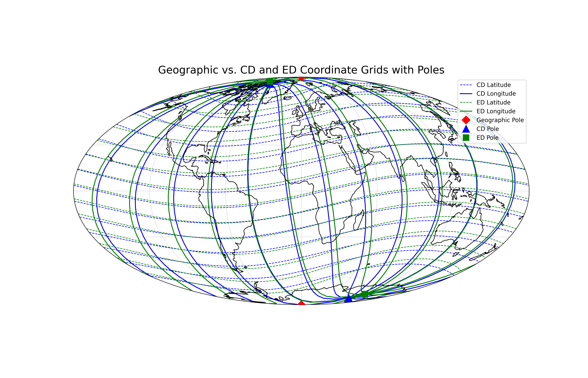

# Geomagnetic Transformations Toolkit
A Python package to perform coordinate and time transformations between geographic, Centered Dipole (CD), and Eccentric Dipole (ED) systems.

The calculations are based on the methods described in the paper "Geomagnetic coordinates, time and field in centred and eccentric dipole approximations" and use the International Geomagnetic Reference Field (IGRF-1990) model coefficients.

### Geomagnetic Transformations Toolkit
A Python package to perform coordinate and time transformations between geographic, Centered Dipole (CD), and Eccentric Dipole (ED) systems.

The calculations are based on the methods described in the paper "Geomagnetic coordinates, time and field in centred and eccentric dipole approximations" and use the International Geomagnetic Reference Field (IGRF-1990) model coefficients.

### Features
Coordinate Transformations: Convert geographic (latitude, longitude) coordinates to Centered Dipole and Eccentric Dipole Cartesian coordinates.

Time Calculations: Determine the local time in the CD and ED reference frames based on a given geographic location and Universal Time (UTC).

Modular Design: Cleanly separated modules for handling parameters, coordinate transformations, and time calculations.

High-Precision: Leverages the PyEphem library for accurate astronomical calculations of the Sun's position, which is essential for time transformations.

### Installation
To install the package, clone the repository and install it locally using pip. It is recommended to install it in an editable (-e) mode, which allows you to modify the source code without reinstalling.

git clone https://github.com/KasturiMurthy123/geomag_transformations.git

cd geomag-transformations

pip install -e .

### Usage
The package provides simple, high-level functions to perform the main transformations.
# Running Example Programs

python examples/run_coordinate_test.py

--- Calculated Parameters for IGRF-1990 ---
Reference Field (B0): 30319.23 nT
CD North Pole Co-latitude: 10.87°
CD North Pole Longitude: -71.12°

Rotation Matrix (Geographic to CD):
[[ 0.31785725 -0.92918725 -0.18862086]
 [ 0.94617103  0.32366708  0.        ]
 [ 0.06105036 -0.17846759  0.98204998]]

ED Geographic Parameters [eta, zeta, xi]: [-0.06223097  0.04250627  0.02917504]
---------------------------------------------

--- Coordinate Transformations for Sample Point ---

Initial Geographic Point (lat=12.0°, lon=88.0°):
  (x, y, z) = [ 217.49 6228.18 1324.65]

Transformed to Centered Dipole (CD) Coordinates:
  (x', y', z') = [-5967.87  2221.64   202.62]

Transformed to Eccentric Dipole (ED) Coordinates:
  (X, Y, Z) = [-5555.14  2509.13    92.61]

Transformed back from ED to Geographic Coordinates:
  (x, y, z) = [ 217.49 6228.18 1324.65]

Verification: Restored geographic point matches original? -> True
-----------------------------------------------------------------
python examples/run_time_test.py
python examples/plot_all_geomagnetic_grids.py

Calculating geomagnetic times for Bengaluru (Lat: 12.9716, Lon: 77.5946)
------------------------------------------------------------
🕒 UTC Time                 : 08:50:18
🕒 Geographic Apparent Time : 14:12:53
🕒 Centered Dipole Time     : 14:21:41
🕒 Eccentric Dipole Time    : 14:22:26

python examples/run_field_test.py

Calculating geomagnetic field for Bengaluru (Lat: 12.9716, Lon: 77.5946)
-----------------------------------------------------------------
🔹 Br (nT)                  : -2633.44
🔹 B_theta (nT)             : -33224.45
🔹 B_lambda (nT)            : -2923.01
🔹 Dip Angle (°)            : 4.51
🔹 Declination Angle (°)    : -174.97

## References: 
Geomagnetic coordinates, time, and field in Centered and Eccentric Dipole approximations. Ramana, K V V , Murthy, K S R N and Khan, Ibrahim, Indian Journal of Radio & Space Physics Vol. 27, February 1998, pp.35-42. http://nopr.niscpr.res.in/handle/123456789/35273

